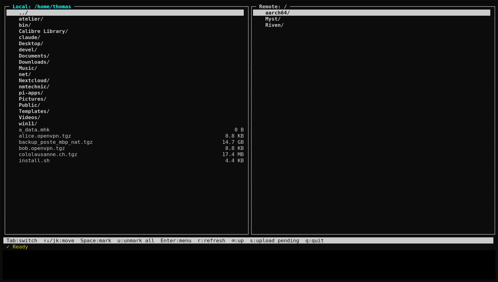
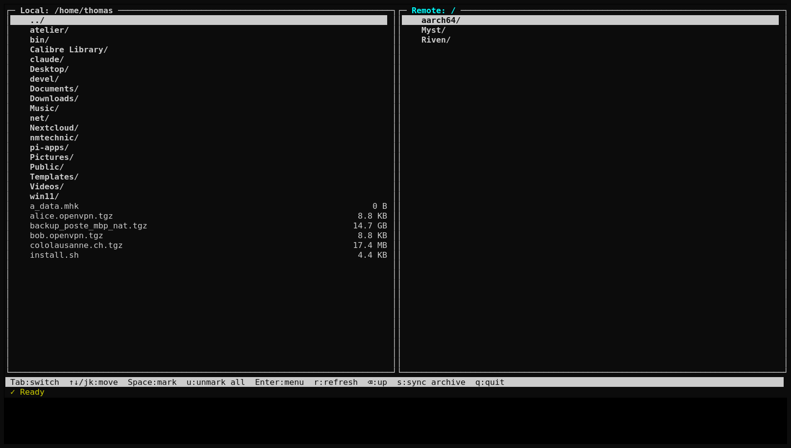
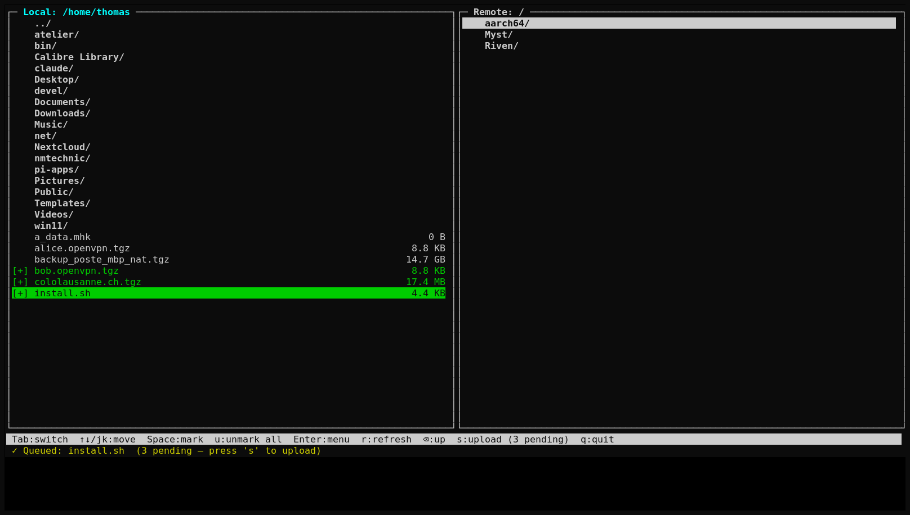
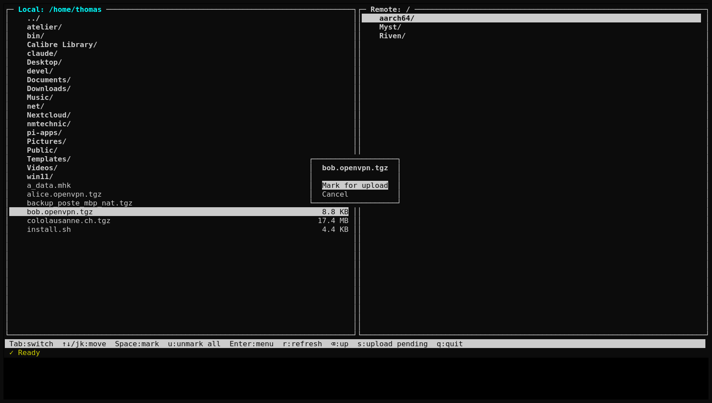
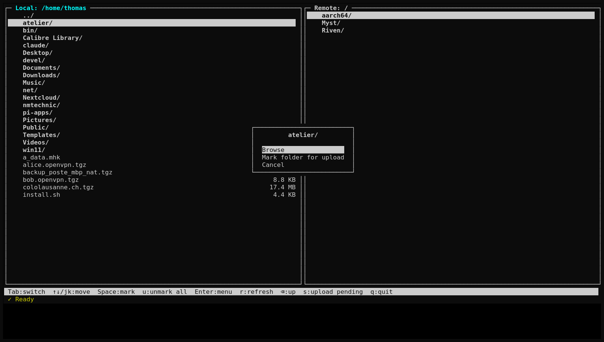
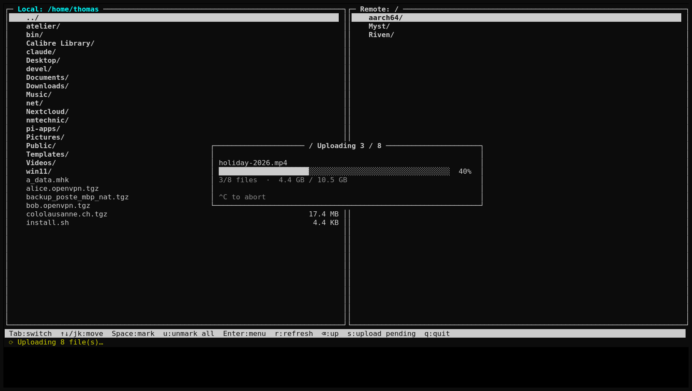
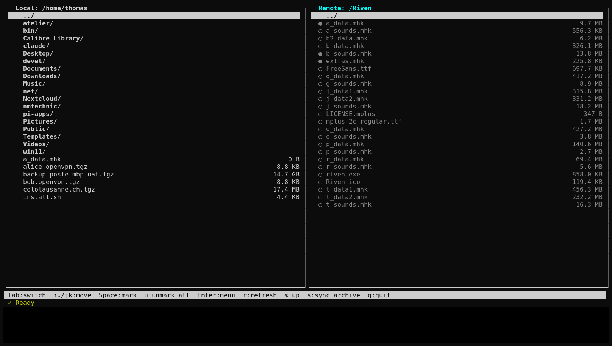
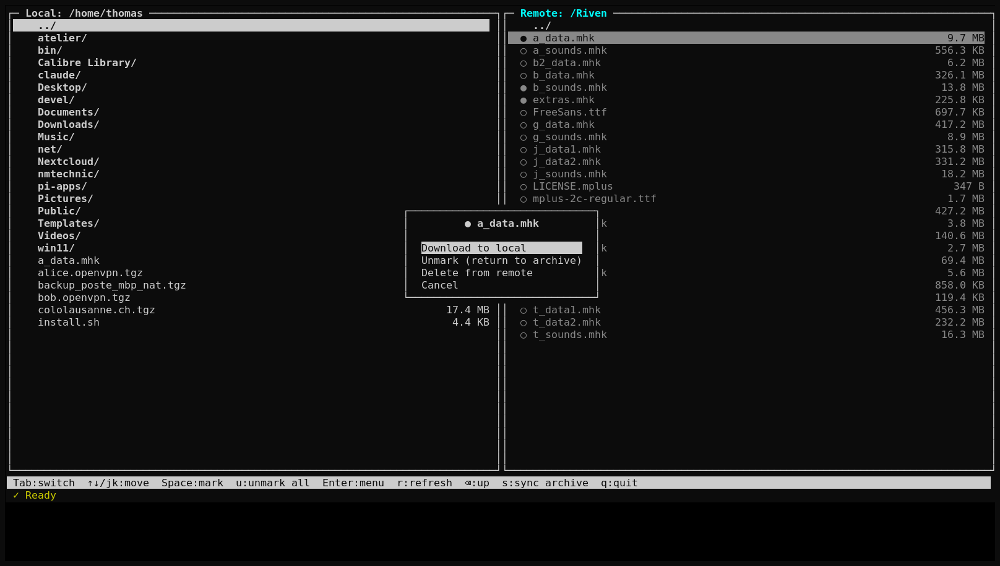
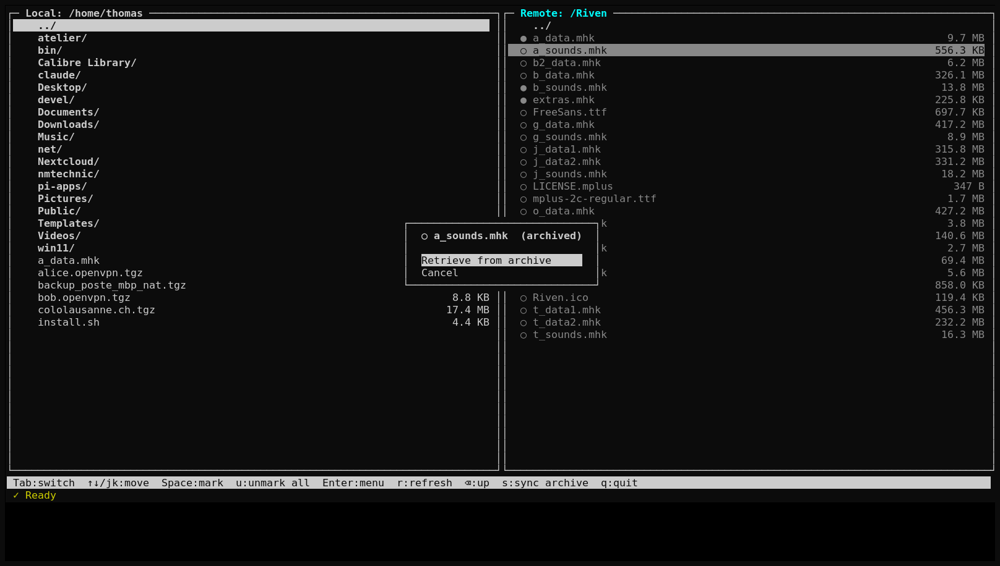
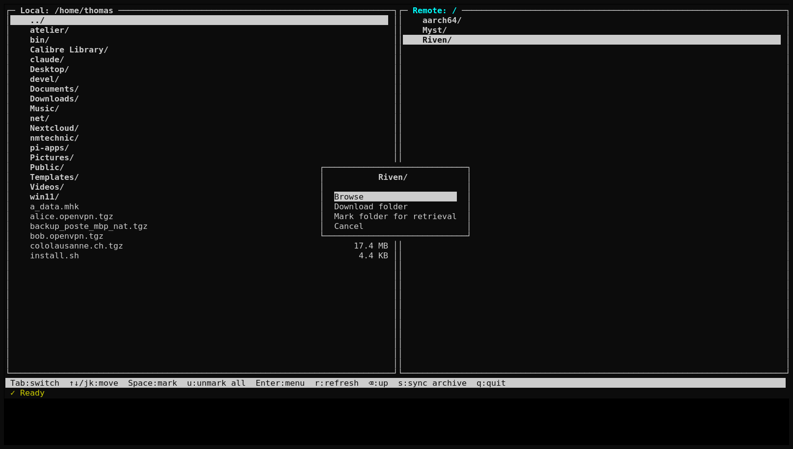

# agOO Filebrowser — User Manual

`filebrowser.py` is an interactive, split-pane terminal UI (TUI) for browsing
and transferring files between your local machine and agOO remote storage.
The left pane is your **local filesystem**; the right pane is the **agOO
remote store** with its two storage tiers (fast online *cache* and slow
*archive*).

It is built on the `agoo` client library and demonstrates uploads (with
automatic batching and a live progress bar), downloads, archive recall, and
cache eviction — all from a keyboard-driven interface.

---

## Contents

- [Getting started](#getting-started)
- [The screen at a glance](#the-screen-at-a-glance)
- [Key bindings](#key-bindings)
- [Local pane — uploading](#local-pane--uploading)
  - [Marking individual files](#marking-individual-files)
  - [Marking a whole folder](#marking-a-whole-folder)
  - [Starting the upload](#starting-the-upload)
  - [The upload progress overlay](#the-upload-progress-overlay)
- [Remote pane — downloading, recall & eviction](#remote-pane--downloading-recall--eviction)
  - [File state indicators](#file-state-indicators)
  - [Cached file menu](#cached-file-menu)
  - [Archived file menu](#archived-file-menu)
  - [Folder menu](#folder-menu)
  - [Triggering an archive sync](#triggering-an-archive-sync)
- [How it works under the hood](#how-it-works-under-the-hood)
- [Troubleshooting](#troubleshooting)

---

## Getting started

### Credentials

The browser reads two environment variables — it will refuse to start if
either is missing:

```bash
export agOO_USER=<your-agoo-user>
export agOO_PASSWORD=<your-agoo-password>
```

### Launch

From the repository root:

```bash
python3 tools/filebrowser.py
```

The browser authenticates, then opens the split-pane view. A terminal at
least ~100 columns wide is recommended.

---

## The screen at a glance



The screen has four regions:

| Region | Description |
|--------|-------------|
| **Left pane** | Your local filesystem (`Local: /home/...`). Starts in your home directory. |
| **Right pane** | The agOO remote store (`Remote: /`). Starts at the storage root. |
| **Hint bar** (second-from-bottom) | The available key bindings for the active pane. |
| **Status bar** (bottom) | `✓` when idle, `⟳` while a blocking operation runs, followed by the latest message. |

The **active** pane has a highlighted (cyan) title. Press <kbd>Tab</kbd> to
switch focus between panes.



---

## Key bindings

These work in either pane unless noted:

| Key | Action |
|-----|--------|
| <kbd>Tab</kbd> | Switch focus between the local and remote pane |
| <kbd>↑</kbd> / <kbd>k</kbd> | Move cursor up |
| <kbd>↓</kbd> / <kbd>j</kbd> | Move cursor down |
| <kbd>Enter</kbd> | Open the context menu for the item under the cursor |
| <kbd>Space</kbd> | *(local pane)* Toggle the upload queue for the file under the cursor |
| <kbd>Backspace</kbd> / <kbd>⌫</kbd> | Go up one directory |
| <kbd>r</kbd> / <kbd>F5</kbd> | Refresh the active pane |
| <kbd>u</kbd> | *(local)* clear the upload queue · *(remote)* clear pending recalls |
| <kbd>s</kbd> | *(local)* upload all queued files · *(remote)* trigger an archive sync |
| <kbd>q</kbd> | Quit |
| <kbd>Ctrl</kbd>+<kbd>C</kbd> | *(during an upload)* abort after the current file finishes |

Inside a context menu, use <kbd>↑</kbd>/<kbd>↓</kbd> (or <kbd>j</kbd>/<kbd>k</kbd>)
to move, <kbd>Enter</kbd> to choose, and <kbd>Esc</kbd> to cancel.

---

## Local pane — uploading

Uploading is a two-step workflow: first **queue** the files you want, then
press <kbd>s</kbd> to send them all at once. Queuing is instant and does no
network I/O, so you can build up a selection across different folders before
committing.

### Marking individual files

Move the cursor onto a file and press <kbd>Space</kbd> to toggle it in the
upload queue. Queued files are shown in green with a `[+]` marker, and the
status bar / hint bar track how many are pending.



You can also press <kbd>Enter</kbd> on a file to get a menu with the same
**Mark for upload** (or **Unmark**, if already queued) action:



Press <kbd>u</kbd> at any time to clear the entire queue.

### Marking a whole folder

Press <kbd>Enter</kbd> on a directory to get its menu:



- **Browse** — descend into the folder.
- **Mark folder for upload** — recursively queue every non-hidden file inside.

Once a folder is fully queued it is shown with a green `[+]`. If you later
unqueue some of its files individually, the folder marker changes to a
magenta `[~]` to show it is only *partially* queued.

### Starting the upload

With at least one file queued, press <kbd>s</kbd> (in the local pane). The
browser hands the whole list to the library's `batch_put()`, which:

1. Measures the available cache space.
2. Uploads as many files as fit.
3. If more remain, triggers an archive sync to reclaim cache space, then
   continues — repeating until everything is uploaded.

You don't have to worry about fitting the files into the cache yourself; the
batching is automatic.

### The upload progress overlay

While the upload runs, a progress overlay appears on top of the panes:



It shows:

- A **rotating spinner** (`| / - \`) in the title, so you can see the upload
  is still alive even while a single large file is transferring.
- The **current filename**.
- A **progress bar** weighted **50 % by file count and 50 % by volume**, so
  the bar advances meaningfully whether you are uploading many small files or
  one large one. (In the example above, 3 of 8 files = 37.5 % and 4.4 GB of
  10.5 GB = ~42 %, averaging to ~40 %.) The bar never moves backwards.
- The raw counts: `N/total files · bytes done / bytes total`.

Press <kbd>Ctrl</kbd>+<kbd>C</kbd> to **abort**. The upload stops cleanly
after the current file finishes; files already sent are removed from the
queue, so pressing <kbd>s</kbd> again retries only what's left.

---

## Remote pane — downloading, recall & eviction

The remote store has two tiers: an online **cache** (fast, directly
downloadable) and an **archive** (slow tape-backed storage). The browser
shows each file's tier with an indicator, and the context menu adapts to the
file's state.

### File state indicators



| Indicator | Style | Meaning |
|-----------|-------|---------|
| `✗` | bold | **Cached, marked for eviction** — in cache, will return to archive on the next sync |
| `●` | dim | **Cached, available** — recalled from archive and ready to download |
| `↑` | italic | **Recall in progress** — an archive recall has been requested |
| `○` | dim | **Archived** — on tape; must be retrieved before it can be downloaded |
| *(none)* | bold | A directory |

> **Note on the indicators:** a freshly-uploaded cached file shows `✗`
> (it has not been explicitly recalled, so the next sync will evict it back
> to archive). After you "Mark for retrieval" it, it shows `●` to indicate it
> will be kept available in cache.

### Cached file menu

Press <kbd>Enter</kbd> on a cached file (`✗` or `●`):



- **Download to local** — stream the file to the current local-pane directory.
- **Unmark (return to archive)** / **Mark for retrieval** — toggle whether the
  file is kept in cache or allowed to be evicted on the next sync.
- **Delete from remote** — permanently remove the file.

### Archived file menu

Press <kbd>Enter</kbd> on an archived file (`○`):



- **Retrieve from archive** — request a recall. The file is marked `↑` while
  the recall is queued. Archive recall is asynchronous: trigger an archive
  sync (<kbd>s</kbd>) to actually start the recall job, then wait for the file
  to switch to `●` (available) before downloading.

### Folder menu

Press <kbd>Enter</kbd> on a remote folder:



- **Browse** — descend into the folder.
- **Download folder** — download every cached file in the folder (spawns
  background downloads, does not block the UI).
- **Mark folder for retrieval** — request a recall for every archived file in
  the folder.

### Triggering an archive sync

Press <kbd>s</kbd> while the remote pane is active to trigger an archive sync.
This runs in the background (the status bar reports progress) and is what
actually performs queued recalls and evictions on the server.

---

## How it works under the hood

The browser is single-threaded for the UI (curses) but offloads every
network operation to background worker threads, so the interface never
freezes waiting on the server:

- The **main thread** owns the screen and drains a message queue every tick.
- **Worker threads** perform uploads, downloads, recalls, syncs, and even the
  remote-pane refresh, posting their results back through the queue.
- Blocking operations (an upload, a single-file download) show `⟳` in the
  status bar and lock input to <kbd>q</kbd> / <kbd>Ctrl-C</kbd> until they
  finish; background operations (folder downloads, recalls, sync) leave the
  UI fully interactive.

This is why the remote pane stays responsive even if the server is slow to
answer a directory listing.

---

## Troubleshooting

| Symptom | Cause / fix |
|---------|-------------|
| `Error: $agOO_USER is not set` on launch | Export `agOO_USER` and `agOO_PASSWORD` before running. |
| `Login failed` | Check the credentials and that the agOO server is reachable. |
| A download says it failed with a 404 | The file is in archive — use **Retrieve from archive**, trigger a sync, wait for `●`, then download. |
| The layout looks cramped or clipped | Widen the terminal; ~100+ columns works best. |
| An archived file's `↑` never clears | Recall is asynchronous — press <kbd>s</kbd> in the remote pane to run the sync that performs the recall, then refresh with <kbd>r</kbd>. |

---

*Screenshots in this manual were captured against a live agOO server. The
file listings shown are example data.*
